# Web Application Document - Projeto Individual - Módulo 2 - Inteli

## Reservantes

#### [Breno Farias Gomes da Silva](https://www.linkedin.com/in/brenofgsilva/)

## Sumário

1. [Introdução](#c1)
2. [Visão Geral da Aplicação Web](#c2)
3. [Projeto Técnico da Aplicação Web](#c3)
4. [Desenvolvimento da Aplicação Web](#c4)
5. [Referências](#c5)

<br>

## <a name="c1"></a>1. Introdução (Semana 01)

&emsp;Reservantes é uma plataforma inovadora desenvolvida para facilitar e modernizar o processo de reservas de mesas em restaurantes. Pensando na comodidade dos usuários e na eficiência dos estabelecimentos, a ferramenta conecta clientes e restaurantes em poucos cliques, eliminando filas de espera e garantindo experiências gastronômicas mais organizadas e agradáveis.

&emsp;O usuário é capaz de escolher o restaurante, consultar a disponibilidade de mesas, selecionar o horário desejado e confirmar a reserva instantaneamente. Já os restaurantes contam com um painel de controle completo para gerenciar suas mesas, horários e reservas, otimizando o fluxo do salão e melhorando a experiência do atendimento.

---

## <a name="c2"></a>2. Visão Geral da Aplicação Web

### 2.1. Personas (Semana 01 - opcional)

_Posicione aqui sua(s) Persona(s) em forma de texto markdown com imagens, ou como imagem de template preenchido. Atualize esta seção ao longo do módulo se necessário._

### 2.2. User Stories (Semana 01 - opcional)

_Posicione aqui a lista de User Stories levantadas para o projeto. Siga o template de User Stories e utilize a referência USXX para numeração (US01, US02, US03, ...). Indique todas as User Stories mapeadas, mesmo aquelas que não forem implementadas ao longo do projeto. Não se esqueça de explicar o INVEST de 1 User Storie prioritária._

---

## <a name="c3"></a>3. Projeto da Aplicação Web

### 3.1. Modelagem do banco de dados (Semana 3)

&emsp;Modelo lógico do banco de dados<br>

<div style ="text-align: center">

Figura 1: MER Banco de Dados
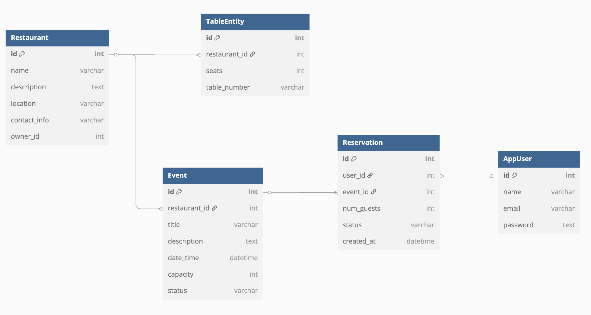

</div>

&emsp;A estrutura começa com a tabela "AppUser", que armazena as informações dos usuários, como nome, e-mail e senha. Cada usuário pode realizar uma ou mais reservas, que são armazenadas na tabela "Reservation", que contém detalhes como o número de convidados, status da reserva e data de criação. Cada reserva é única e ligada diretamente com o evento em que esta sendo planejado, o usuário poderá definir a quantidade de convidados, e conferir a disponibilidade da reserva. Os eventos, armazenados na tabela "Events", pertencem aos restaurantes, armazenados na tabela "Restaurants" pois é gerado um id para cada estabelecimento (restaurant_id) com o intuito de poder armazenar eventos para vários restaurantes. A tabela "TableEntity" servirá para fazer a conexão com o espaço de mesas disponibilizado pelo restaurante, para que o usuário possa escolher em qual mesa, e quantas cadeiras será necessário para sua reserva.

&emsp;Código SQL

```sql
CREATE TABLE Restaurant (
    id SERIAL PRIMARY KEY,
    name TEXT NOT NULL,
    description TEXT,
    location TEXT,
    contact_info TEXT,
    owner_id INTEGER
);

```

&emsp;Criação de uma tabela para o banco de dados com suas devidas propriedades

```sql
CREATE TABLE Event (
    id SERIAL PRIMARY KEY,
    restaurant_id INTEGER NOT NULL,
    title VARCHAR(100) NOT NULL,
    description TEXT,
    date_time TIMESTAMP NOT NULL,
    capacity INTEGER NOT NULL,
    status VARCHAR(50) DEFAULT 'open',
    FOREIGN KEY (restaurant_id) REFERENCES Restaurant(id)
);

CREATE TABLE TableEntity (
    id SERIAL PRIMARY KEY,
    restaurant_id INTEGER NOT NULL,
    seats INTEGER NOT NULL,
    table_number VARCHAR(20),
    FOREIGN KEY (restaurant_id) REFERENCES Restaurant(id)
);

CREATE TABLE AppUser (
    id SERIAL PRIMARY KEY,
    name VARCHAR(100) NOT NULL,
    email VARCHAR(100) UNIQUE NOT NULL,
    password_hash TEXT NOT NULL
);

CREATE TABLE Reservation (
    id SERIAL PRIMARY KEY,
    user_id INTEGER NOT NULL,
    event_id INTEGER NOT NULL,
    num_guests INTEGER NOT NULL,
    status VARCHAR(50) DEFAULT 'Aguardando',
    created_at TIMESTAMP DEFAULT CURRENT_TIMESTAMP,
    FOREIGN KEY (user_id) REFERENCES AppUser(id),
    FOREIGN KEY (event_id) REFERENCES Event(id)
);
```

&emsp;É possível criar uma ligação entre tabelas utilizando o comando REFERENCES. Esse comando define uma chave estrangeira em uma tabela que aponta para a chave primária de outra tabela, possibilitando a conexão entre os dados.

### 3.1.1 BD e Models (Semana 5)

_Descreva aqui os Models implementados no sistema web_

### 3.2. Arquitetura (Semana 5)

<div style ="text-align: center">

Figura 2: Arquitetura da aplicação

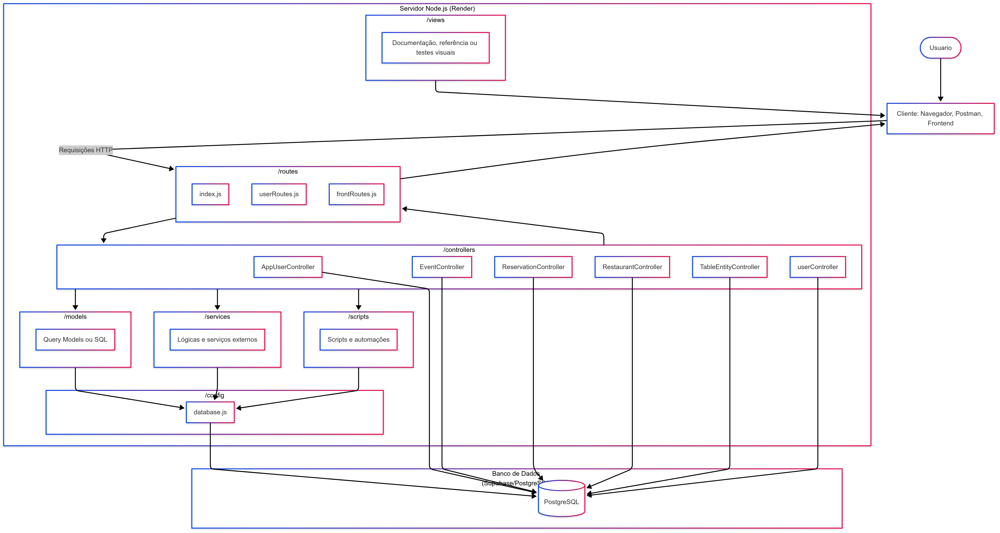

</div>

### 3.3. Wireframes (Semana 03 - opcional)

_Posicione aqui as imagens do wireframe construído para sua solução e, opcionalmente, o link para acesso (mantenha o link sempre público para visualização)._

### 3.4. Guia de estilos (Semana 05 - opcional)

_Descreva aqui orientações gerais para o leitor sobre como utilizar os componentes do guia de estilos de sua solução._

### 3.5. Protótipo de alta fidelidade (Semana 05 - opcional)

_Posicione aqui algumas imagens demonstrativas de seu protótipo de alta fidelidade e o link para acesso ao protótipo completo (mantenha o link sempre público para visualização)._

### 3.6. WebAPI e endpoints (Semana 05)

_Utilize um link para outra página de documentação contendo a descrição completa de cada endpoint. Ou descreva aqui cada endpoint criado para seu sistema._

# Endpoints da API - Sistema Reservantes

O sistema Reservantes possui uma API REST completa para gerenciamento de reservas de restaurantes. Todos os endpoints seguem o padrão CRUD (Create, Read, Update, Delete) e retornam dados em formato JSON.

## Base URL

```
http://localhost:3000/api
```

## 1. Restaurantes

### `GET /api/restaurantes`

**Descrição:** Lista todos os restaurantes cadastrados no sistema.
**Método:** GET
**Parâmetros:** Nenhum
**Retorno:** Array de objetos restaurante

```json
[
  {
    "id": 1,
    "name": "Restaurante Exemplo",
    "description": "Descrição do restaurante",
    "location": "Endereço do restaurante",
    "contact_info": "Telefone ou email",
    "owner_id": 123
  }
]
```

### `POST /api/restaurantes`

**Descrição:** Cria um novo restaurante.
**Método:** POST
**Body:**

```json
{
  "name": "Nome do Restaurante",
  "description": "Descrição opcional",
  "location": "Localização",
  "contact_info": "Informações de contato",
  "owner_id": 123
}
```

**Retorno:** Objeto do restaurante criado

### `PUT /api/restaurantes/:id`

**Descrição:** Atualiza um restaurante existente.
**Método:** PUT
**Parâmetros:** `id` - ID do restaurante
**Body:** Mesmo formato do POST
**Retorno:** Objeto do restaurante atualizado

### `DELETE /api/restaurantes/:id`

**Descrição:** Remove um restaurante do sistema.
**Método:** DELETE
**Parâmetros:** `id` - ID do restaurante
**Retorno:** Mensagem de confirmação

## 2. Eventos

### `GET /api/eventos`

**Descrição:** Lista todos os eventos cadastrados.
**Método:** GET
**Retorno:** Array de objetos evento

```json
[
  {
    "id": 1,
    "restaurant_id": 1,
    "title": "Jantar Especial",
    "description": "Evento especial de jantar",
    "date_time": "2025-12-31T20:00:00Z",
    "capacity": 50,
    "status": "open"
  }
]
```

### `POST /api/eventos`

**Descrição:** Cria um novo evento.
**Método:** POST
**Body:**

```json
{
  "restaurant_id": 1,
  "title": "Nome do Evento",
  "description": "Descrição do evento",
  "date_time": "2025-12-31T20:00:00Z",
  "capacity": 50,
  "status": "open"
}
```

### `PUT /api/eventos/:id`

**Descrição:** Atualiza um evento existente.
**Método:** PUT
**Parâmetros:** `id` - ID do evento
**Body:** Mesmo formato do POST

### `DELETE /api/eventos/:id`

**Descrição:** Remove um evento do sistema.
**Método:** DELETE
**Parâmetros:** `id` - ID do evento

## 3. Usuários

### `GET /api/usuarios`

**Descrição:** Lista todos os usuários do sistema.
**Método:** GET
**Retorno:** Array de objetos usuário

```json
[
  {
    "id": 1,
    "name": "João Silva",
    "email": "joao@email.com",
    "password_hash": "hash_da_senha"
  }
]
```

### `POST /api/usuarios`

**Descrição:** Cria um novo usuário.
**Método:** POST
**Body:**

```json
{
  "name": "Nome do Usuário",
  "email": "email@exemplo.com",
  "password": "senha123"
}
```

### `PUT /api/usuarios/:id`

**Descrição:** Atualiza um usuário existente.
**Método:** PUT
**Parâmetros:** `id` - ID do usuário
**Body:** Mesmo formato do POST

### `DELETE /api/usuarios/:id`

**Descrição:** Remove um usuário do sistema.
**Método:** DELETE
**Parâmetros:** `id` - ID do usuário

## 4. Reservas

### `GET /api/reservas`

**Descrição:** Lista todas as reservas do sistema.
**Método:** GET
**Retorno:** Array de objetos reserva

```json
[
  {
    "id": 1,
    "user_id": 1,
    "event_id": 1,
    "num_guests": 4,
    "status": "pending",
    "created_at": "2025-01-01T10:00:00Z"
  }
]
```

### `POST /api/reservas`

**Descrição:** Cria uma nova reserva.
**Método:** POST
**Body:**

```json
{
  "user_id": 1,
  "event_id": 1,
  "num_guests": 4,
  "status": "pending"
}
```

### `PUT /api/reservas/:id`

**Descrição:** Atualiza uma reserva existente.
**Método:** PUT
**Parâmetros:** `id` - ID da reserva
**Body:** Mesmo formato do POST

### `DELETE /api/reservas/:id`

**Descrição:** Remove uma reserva do sistema.
**Método:** DELETE
**Parâmetros:** `id` - ID da reserva

## 5. Mesas

### `GET /api/mesas`

**Descrição:** Lista todas as mesas cadastradas.
**Método:** GET
**Retorno:** Array de objetos mesa

```json
[
  {
    "id": 1,
    "restaurant_id": 1,
    "seats": 4,
    "table_number": "Mesa 1"
  }
]
```

### `POST /api/mesas`

**Descrição:** Cria uma nova mesa.
**Método:** POST
**Body:**

```json
{
  "restaurant_id": 1,
  "seats": 4,
  "table_number": "Mesa 1"
}
```

### `PUT /api/mesas/:id`

**Descrição:** Atualiza uma mesa existente.
**Método:** PUT
**Parâmetros:** `id` - ID da mesa
**Body:** Mesmo formato do POST

### `DELETE /api/mesas/:id`

**Descrição:** Remove uma mesa do sistema.
**Método:** DELETE
**Parâmetros:** `id` - ID da mesa

## Status de Resposta

- **200 OK:** Operação realizada com sucesso
- **201 Created:** Recurso criado com sucesso
- **404 Not Found:** Recurso não encontrado
- **500 Internal Server Error:** Erro interno do servidor

## Observações

1. **Autenticação:** O sistema atual não possui autenticação implementada
2. **Validação:** Campos marcados com `*` são obrigatórios
3. **Relacionamentos:** As entidades estão relacionadas através de chaves estrangeiras:
   - Eventos pertencem a Restaurantes (`restaurant_id`)
   - Mesas pertencem a Restaurantes (`restaurant_id`)
   - Reservas são feitas por Usuários (`user_id`) para Eventos (`event_id`)
4. **Status dos Eventos:** `open`, `closed`, `cancelled`
5. **Status das Reservas:** `pending`, `confirmed`, `cancelled`

### 3.7 Interface e Navegação (Semana 07)

_Descreva e ilustre aqui o desenvolvimento do frontend do sistema web, explicando brevemente o que foi entregue em termos de código e sistema. Utilize prints de tela para ilustrar._

Dashboard Do Sistema

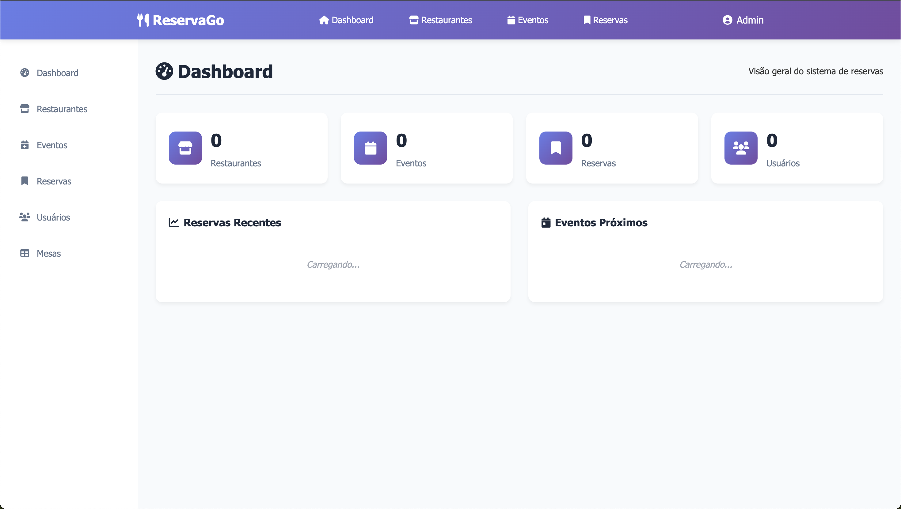

---

Restaurantes

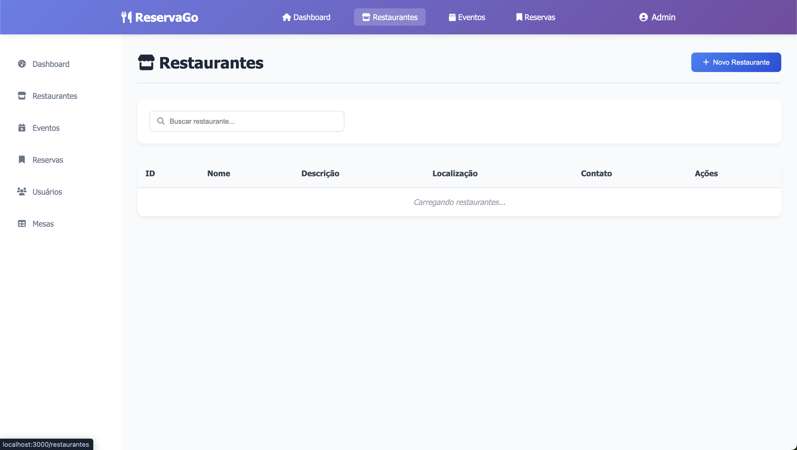

Registro Restaurantes

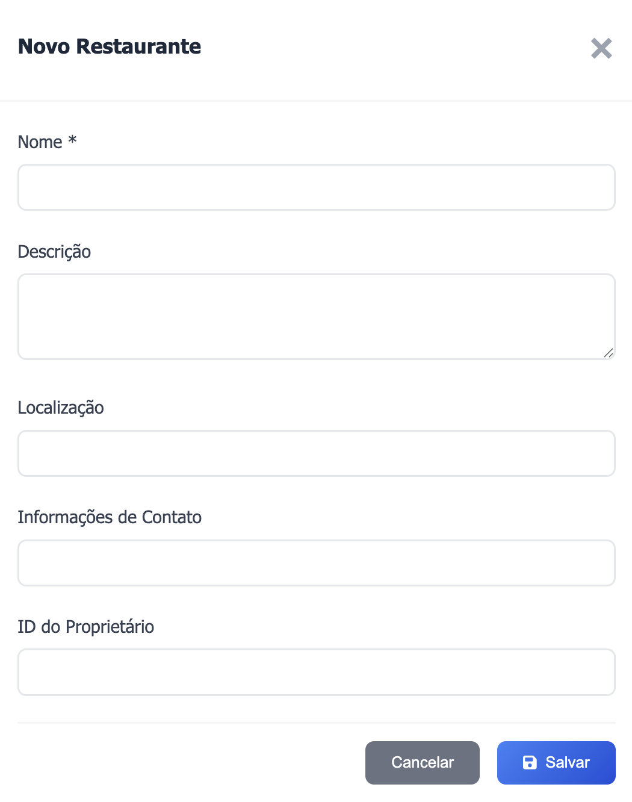

---

Eventos

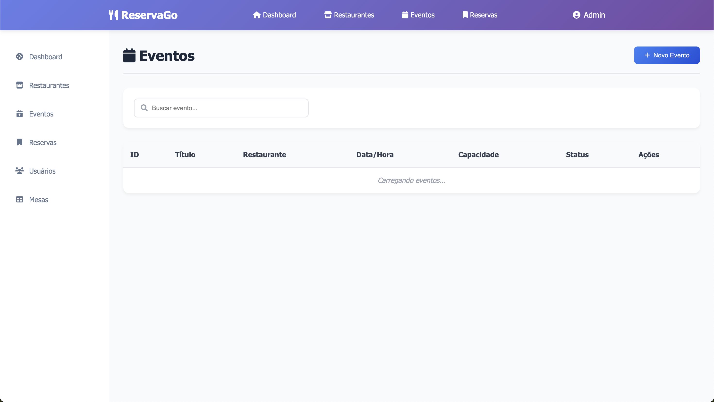
Registro Eventos

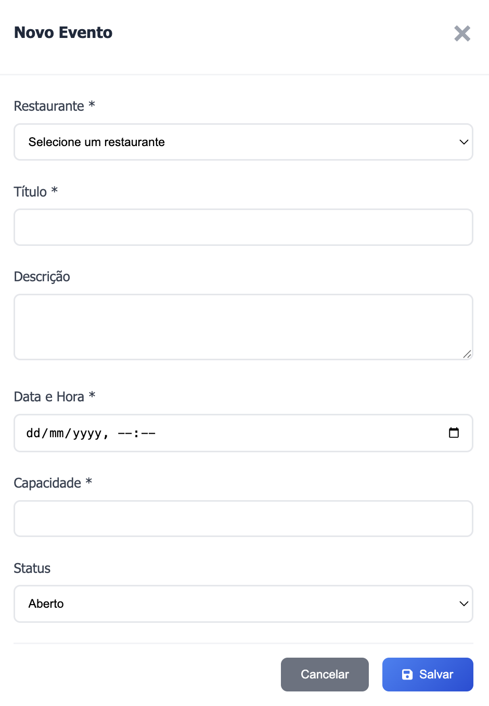

---

Reserva

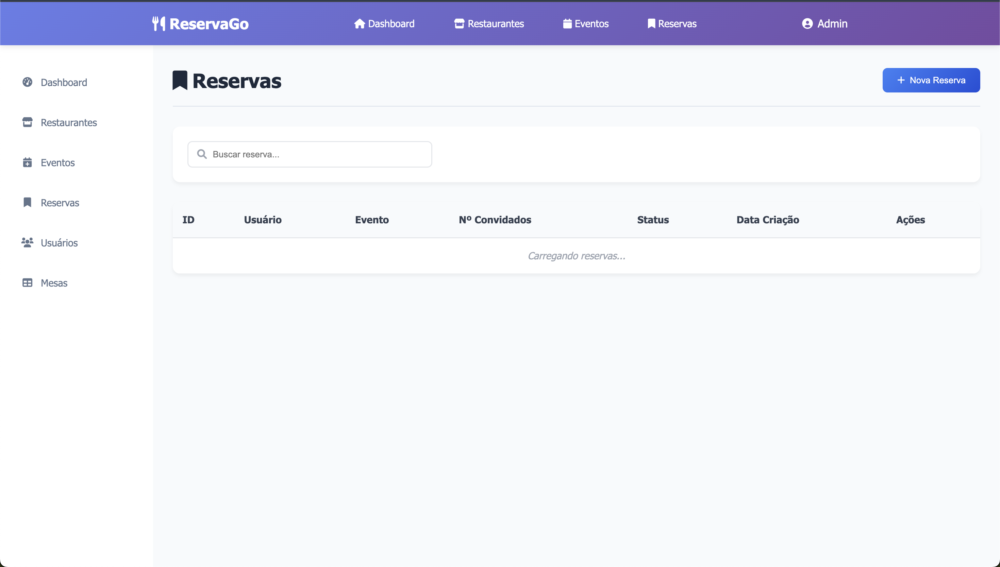
Registro Reserva

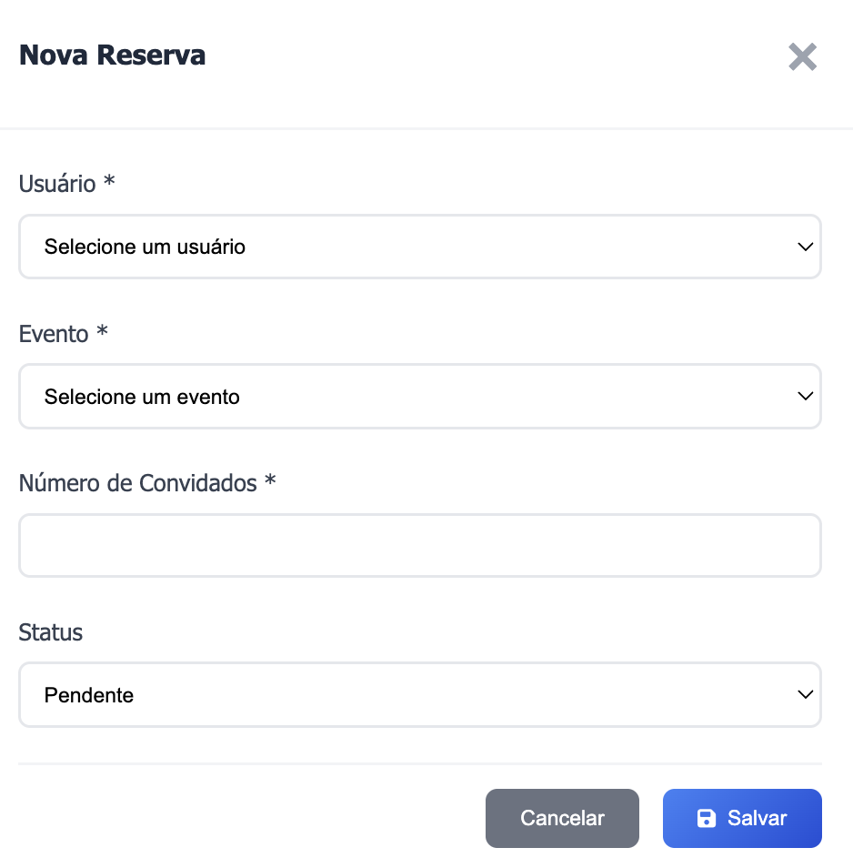

---

Mesas

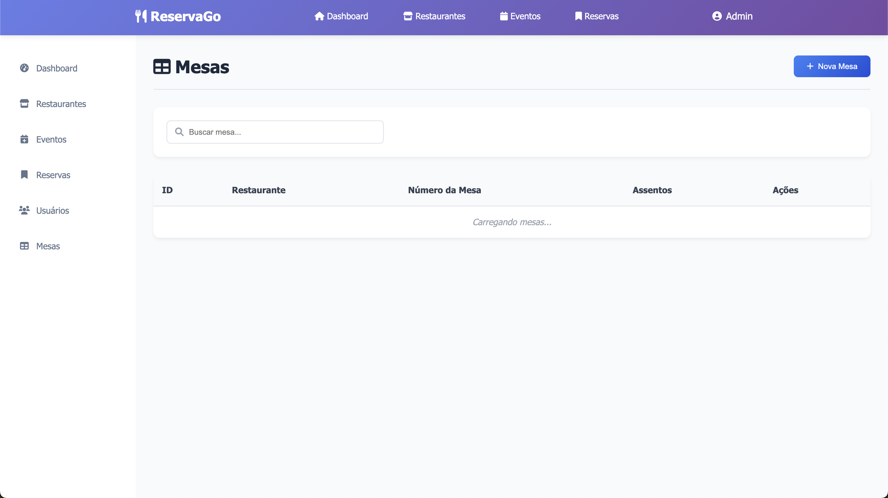
Registro Mesas

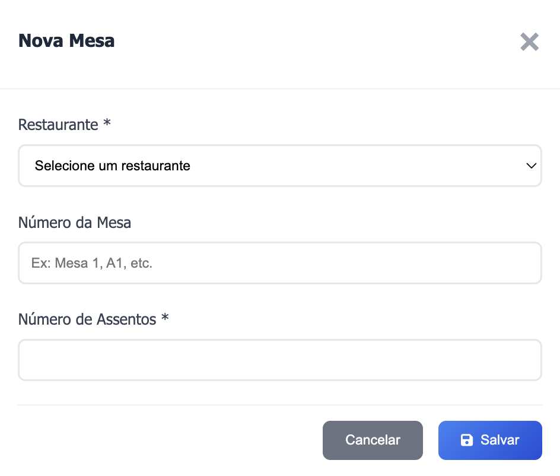

## <a name="c4"></a>4. Desenvolvimento da Aplicação Web (Semana 8)

### 4.1 Demonstração do Sistema Web (Semana 8)

_VIDEO: Insira o link do vídeo demonstrativo nesta seção_
_Descreva e ilustre aqui o desenvolvimento do sistema web completo, explicando brevemente o que foi entregue em termos de código e sistema. Utilize prints de tela para ilustrar._

### 4.2 Conclusões e Trabalhos Futuros (Semana 8)

_Indique pontos fortes e pontos a melhorar de maneira geral._
_Relacione também quaisquer outras ideias que você tenha para melhorias futuras._

## <a name="c5"></a>5. Referências

_Incluir as principais referências de seu projeto, para que o leitor possa consultar caso ele se interessar em aprofundar._<br>

---

---
